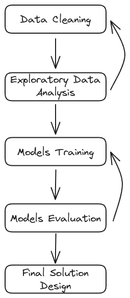

# Project Workflow

For building the music recommendation system, it will be necessary to follow a structured workflow. The model's performance will be iteratively improved by tweaking the models or features until the evaluation metrics are satisfactory.

The project workflow is as follows:

1. **Data Cleaning:** In this initial phase, this involve removing duplicate records, handling missing values, removing any anomalies, and converting data into a usable format. Ensure that the user listening history data is clean, consistent, and ready for analysis.

2. **Exploratory Data Analysis (EDA):** EDA is a critical step where you would explore the data to find patterns, anomalies, or relationships that could inform the subsequent modeling. This might involve analyzing which songs are most popular, the listening habits of users.

3. **Models Training:** Based on the insights gained during EDA, you would select and train machine learning models. These models could be based on various algorithms such as collaborative filtering, matrix factorization or neural collaborative filtering. They would use the historical data of what users have listened to for predicting future song recommendations.

4. **Model Evaluation:** The trained models are assessed to determine how well they perform tasks such as predicting user preferences or suggesting new songs. After training, each model will be evaluated on its performance using appropriate metrics, such as precision@k, recall@k, F1 score, or mean absolute error. Evaluation could be conducted through techniques like cross-validation or using a separate test dataset to ensure that the model generalizes well to unseen data.

5. **Final Solution Design:** After the models have been evaluated and iteratively refined, this step focuses on the practical application of the model in a real-world scenario. It involves designing the software architecture that integrates the recommendation model into a user-facing system, addressing concerns like scalability, user interface, and system responsiveness.
