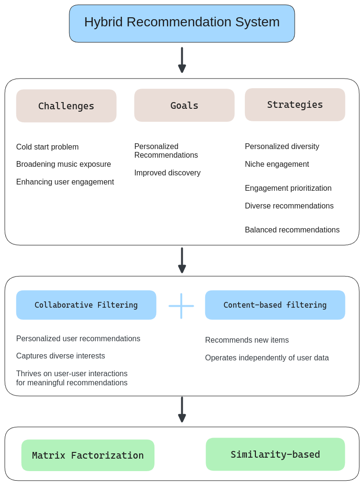

# Music Recommendation System

## Executive Summary

### Summary of the problem
The crux of the problem lies in devising a recommendation system that not only navigates the vast and varied musical landscape but also personalizes the experience to cater to individual user preferences. Encouraging exploration while also offering avenues for deeper engagement with tracks in which users have shown initial interest could enhance user satisfaction.

### Insights from the EDA

The data reveals a concerning trend where the majority of songs are played only once, suggesting that current song discovery mechanisms fall short of effectively promoting musical diversity and sustaining user engagement. Indicates an opportunity for improving song discovery mechanisms. 

The distribution of song counts by artists: The largest portion of the dataset consists of artists who have only one song listed, making up nearly 45% of the dataset. The second largest group consists of artists with between 6 and 25 songs, representing over 28% of the dataset. This shows that there's a substantial number of artists who have a moderate presence in the dataset. For a recommendation system, this could mean a good balance of depth in choices for users who enjoy songs from the same artist.

### Rationale Behind the Proposed Solution

The system aims to address the cold start problem, which is the difficulty of providing recommendations when there is little to no data on a new user. It also seeks to broaden music exposure and enhance user engagement with the platform.

The goals set forth are to provide personalized recommendations and to improve discovery for users, ensuring they find content that is relevant and appealing to them. To meet these goals, the system employs several strategies, including ensuring personalized diversity in recommendations, engaging users in niche content, prioritizing engagement, and providing a balance of diverse recommendations.

### Key Actionable for Stackholders

1. **Tracking of Engagement Metrics:** Monitor user engagement metrics like user-play ratios, and user retention to understand how users are interacting with the platform and the effectiveness of recommendations.
2. **Curated Experiences:** The analysis of song pairs listened to by varying numbers of users presents an opportunity for crafting curated playlists or song sequences.
3. **Exploration and Diversity:** Implement features that encourage exploration, such as "Discover Weekly" playlists, artist spotlights, or "This Day in Music History" features to cover a wide range of artists and years.
4. **Feedback Loops:** Implement mechanisms for collecting user feedback on recommendations (e.g., likes, skips) to refine and adapt the recommendation algorithms over time.
5. **Context-Aware Recommendations:** Incorporate contextual factors such as time of day, day of the week, season, and user activity into the dataset for future improvement of the recommendation system, to provide more relevant and timely recommendations.

## Proposed Solution Overview

The Hybrid Recommendation system approach is address leveraging both user behavior and item characteristics to provide tailored suggestions to users.

**Goal:** Enhancing user satisfaction through personalized, engaging, and diverse music recommendations.

### Challenges

The challenge is twofold: to introduce users to a broader spectrum of music, thereby addressing the "cold start" problem, and to foster repeated engagement with tracks that resonate with the users. Achieving this balance requires a nuanced understanding of user behavior, musical trends, and the intricate dynamics of musical preference.

### Strategy Implementation

The system will leverage insights from user play counts, engagement metrics, and the distribution of musical preferences to offer a dynamic, personalized music listening experience. By addressing the identified gaps in music discovery and engagement, the recommendation system seeks to enrich the user experience, promote musical diversity, and ultimately, rekindle the joy of discovering new music.

#### Personalization

There are songs for some years and artists a high number of users have interacted with.
While there are certain years that engage a large user base, they are few compared to years and artists that engage progressively fewer users. The recommendation system could also use this data to identify potential fans of niche artists by analyzing user listening patterns and suggest undiscovered music to them. This approach can enhance the user experience by personalizing recommendations

This approach can enhance the user experience by personalizing recommendations and promoting music diversity.

#### Leverage Engagement

Utilize user-plays ratio as song score to prioritize songs that have a higher likelihood of engaging users. This could involve promoting songs that have been played multiple times by similar users but are new to the current user.

Tailoring recommendations to include a mix of songs with varying play counts could cater to diverse user preferences, from seeking novelty to indulging in favorites. This could imply that there may be an opportunity to improve engagement by finding better matches for users' tastes.

#### Hybrid Recommendation Models

Use a combination of collaborative filtering, content-based filtering, and machine learning models to ensure a diverse set of recommendations. This approach allows for balancing between matching user preferences and introducing novelty.

#### Scalability and Performance

The recommendation system can handle the growing amount of data and user queries as the user base expands. 

# Solution Implementation

## 0. Project Workflow

For building the music recommendation system, it will be necessary to follow a structured workflow. The model's performance will be iteratively improved by tweaking the models or features until the evaluation metrics are satisfactory.

See the [Project Workflow](./PROJ-WORKFLOW.md) for the detailed project workflow.

## 1. Data Cleaning

See the [data-cleaning](./data-cleaning.ipynb) notebook for the data cleaning process.

## 2. Exploratory Data Analysis (EDA)

See the [EDA](./eda.ipynb) notebook for the data cleaning process.

## 3. Models Training

See the [Method and Techniques Review](./METHODS-TECH.md) for the detailed review of methods and techniques.

### 4.1 Model Selection

## 5. Models Evaluation

TBD

## 6. Final Solution Design

TBD
