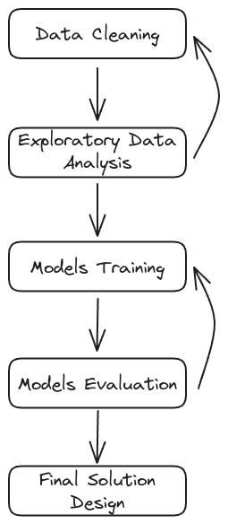

# Music Recommendation System

## 1. Problem Definition

### 1.1 Problem Statement

The goal of this project is to build a recommendation system that can predict a song that is played by a user. The system should be able to recommend songs to users based on their listening history or the listening history of other users.

### 1.2 Project Workflow

For building the music recommendation system, it will be necessary to follow a structured workflow. The model's performance will be iteratively improved by tweaking the models or features until the evaluation metrics are satisfactory.

The project workflow is as follows:

1. **Data Cleaning:** In this initial phase, this involve removing duplicate records, handling missing values, removing any anomalies, and converting data into a usable format. Ensure that the user listening history data is clean, consistent, and ready for analysis.

2. **Exploratory Data Analysis (EDA):** EDA is a critical step where you would explore the data to find patterns, anomalies, or relationships that could inform the subsequent modeling. This might involve analyzing which songs are most popular, the listening habits of users.

3. **Models Training:** Based on the insights gained during EDA, you would select and train machine learning models. These models could be based on various algorithms such as collaborative filtering, matrix factorization or neural collaborative filtering. They would use the historical data of what users have listened to for predicting future song recommendations.

4. **Model Evaluation:** The trained models are assessed to determine how well they perform tasks such as predicting user preferences or suggesting new songs. After training, each model will be evaluated on its performance using appropriate metrics, such as precision@k, recall@k, F1 score, or mean absolute error. Evaluation could be conducted through techniques like cross-validation or using a separate test dataset to ensure that the model generalizes well to unseen data.

5. **Final Solution Design:** After the models have been evaluated and iteratively refined, this step focuses on the practical application of the model in a real-world scenario. It involves designing the software architecture that integrates the recommendation model into a user-facing system, addressing concerns like scalability, user interface, and system responsiveness.

## 2. Data Cleaning

See the [data-cleaning](./data-cleaning.ipynb) notebook for the data cleaning process.

## 2.1 Data Set Description

**Categorial features**

- **artist**: a person or group that creates music. Only `artist name` is available in the dataset.
- **release**: one song (single) a collection of songs (album). Only `release` name is available in the dataset.
- **year** (of release): the `year` the song was released.
- **song**: a musical composition. `Title` and `song ID` is available in the dataset.
- **user**: a person who listens to music. Only `user ID` is available in the dataset.

**Numerical features**

- **play count**: the number of times a song was played by a user. This is given as total `play count` for each song by each user.

## 3. Exploratory Data Analysis (EDA)

TBD

## 4. Models Training

### 4.1 Model Selection

This diagram serves as a guide for considering which methods and implementation techniques to use when evaluating models or implementing a final solution in recommendation systems. Each method and technique has its own set of applications, advantages, and considerations that make it suitable for different kinds of recommendation system problems.

#### Methods

| Methods | Content-Based Filtering | Collaborative Filtering |
| ------ | ----------------------- | ----------------------- |
| **Pros** | | |
| Personalization | Highly personalized as it recommends items based on a user's previous actions and explicit preferences. | Can provide personalized recommendations by leveraging user-user similarities without needing content analysis. |
| Transparency | Recommendations are directly related to item attributes, which can be explained to users. | Algorithms like memory-based collaborative filtering can be more transparent because they are based on human-like notions of similarity among items or users. |
| New Items | Can recommend new and unseen items as long as item features are available. | Struggles with new items until enough user interactions are collected (cold start problem). |
| User Independence | Does not require data on other users, making it effective even with a sparse user base. | Relies on the availability of other users' data to find similarities and patterns. |
| **Cons** | | |
| Limited Diversity | Tends to recommend items similar to what the user has already seen, potentially limiting diversity. | Better at capturing diverse interests of users since it can recommend items that are unexpectedly liked by similar users. |
| Content Limitation | Only as effective as the metadata it can use to describe items, which can be limiting or biased. | Not limited by content metadata and can work on implicit data such as user behavior. |
| Over-Specialization | May overfit to a user's profile and fail to recommend items outside of that profile. | Can mitigate over-specialization by introducing new items that similar users liked. |
| Cold Start Problem | Requires sufficient content features to start making recommendations for new items. | Requires enough users and item interactions to make meaningful recommendations (user cold start problem). |
| Scalability | Computationally efficient as it deals with user profiles and item features, often fixed in size. | Can be computationally expensive as the user-item matrix grows with more users and items. |

#### Implementation Techniques

| Factor | Similarity-Based | Matrix Factorization | Clustering-Based | Multilayer Perceptron |
| ------ | ---------------- | -------------------- | ---------------- | --------------------- |
| **Pros** | | | | |
| Interpretability | Easy to understand and interpret. | Latent factors can sometimes be interpreted to understand user/item characteristics. | Clusters can be interpretable, showing what items/users have been grouped together. | With small networks, weights can be interpreted to some extent. |
| Simplicity | Simple to implement and explain. | Algorithms like SVD are well-studied and understood. | Conceptually simple and can use off-the-shelf algorithms. | Can capture complex nonlinear relationships that other techniques may miss. |
| Performance | Can be effective if similarity metrics are well-defined. | Often produces better recommendations than similarity-based methods. | Can handle large datasets by segmenting into smaller, more manageable clusters. | Can outperform other methods on large and complex datasets. |
| **Cons** | | | | |
| Scalability | Does not scale well with large datasets, as it requires comparing all pairs of items or users. | Requires significant computational resources for large datasets. | Determining the number of clusters and their validity can be challenging. | Requires a lot of data to train and can be computationally intensive. |
| Cold Start | Suffers from the cold start problem for new items/users. | Also struggles with new items/users without prior ratings. | New items/users need to be assigned to clusters, which may not be straightforward. | The cold start problem is significant; it's difficult to make predictions without user data. |
| Diversity | Recommendations lack diversity if items/users are too similar. | May over-specialize to observed data and not recommend diverse items. | Recommendations within clusters may lack diversity. | May recommend items too narrowly focused on user's past behavior. |
| Overfitting | Less prone to overfitting due to simplicity. | Can overfit, especially with many latent factors and sparse data. | Clusters may not generalize well to new data if overfitted. | Prone to overfitting unless regularized and properly validated. |
| Dynamic Updates | Can be computationally expensive to update similarities in real-time. | Models often need retraining to incorporate new data. | Clusters need to be updated as new data comes in, which can be complex. | Requires retraining or fine-tuning for new data, which can be resource-heavy. |

## 5. Models Evaluation

TBD

## 6. Final Solution Design

TBD
